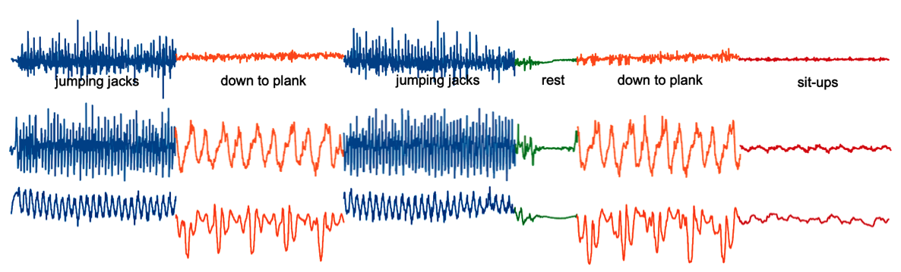

## Human Activity Segmentation Challenge

Human activity recognition (HAR) is essential for health monitoring, personal security, and various other applications. Current HAR systems process fixed-length subsequences of sensor data, e.g. 1 second, leading to performance losses for longer complex activities. This challenge focuses on improving accuracy of such systems by exploring the under-studied area of partitioning real-world, multi-variate human motion sensor data into variable-sized activity segments. You will work with a large new data set featuring 10.7 hours of multi-dimensional smartphone sensor data from students performing 100 different daily activities. Your objective is to accurately segment this complex motion data into an unknown number of single activities.

## Organization and Registration

This competition is hosted by the <a href="https://2023.ecmlpkdd.org/submissions/discovery-challenge/challenges/" target="_blank">ECML/PKDD 2023 conference</a> as a *Discovery Challenge*. It is organized using the Kaggle platform starting 11th April and ending 11th June. The results and top three winning solutions will be presented at the AALTD workshop in September, 2023. 

**Please fill out this <a href="https://docs.google.com/forms/d/1BoAJWlhCVU0LUeDLzb7GOBM4MTk2AKkfpY--hk987-0" target="_blank">google form</a> to register for the challenge. Upon registration, we will send you the invitation link to the Kaggle competition website via mail. Participants are strictly prohibited from registering multiple times to gain an unfair advantage. No pseudonyms may be used for registration.**

## Data Description

We collected a data set of 250 twelve-dimensional multivariate TS, sampled at 50 Hertz (Hz). These TS contain between seven seconds and fourteen minutes (median 100 seconds) of human motion data, capturing few to many potentially recurring activities from a total of one hundred different ones, each lasting for variable time durations. An example of a sport routine, captured as an acceleration, gyroscope and magnetometer recording, with 6 segments is shown below. Your task in this challenge is to predict the location of the activity changes, e.g. after 30 seconds, 60 seconds etc. The data, evaluation measure, submission rules and more information is provided after registration. 



## Awards

The **top three** ranking competitors in this challenge will be rewarded with:

* free ECML/PKDD 2023 conference registrations
* oral presentation of their solution at AALTD
* publication of their approach in the workshop proceedings

The specific competition rules and requirements to be eligible for rewards are available on the Kaggle platform.

## Timeline
The challenge has two primary phases and a follow-up period for the top three best-ranking competitors. In the first phase, new competitors can join and start working on the segmentation problem. In the second phase, no new participants can join the challenge any more and the existing participants may focus on optimizing their approaches. After the competition ends, the three best-scoring competitors must write a report on their approach and publish their code.

* Start of competition: Tuesday, 11th April 2023, 11:59 PM UTC
* No more new competitors allowed: Thursday, 12th May 2023, 11:59 PM UTC
* End of competition: Sunday, 11th June 2023 UTC, 11:59 PM UTC
* Witten report submission deadline: Monday, 3rd July 2023 (planned)
* Acceptance notification: Monday, 17thd July 2023 (planned)
* Camera-ready deadline: Sunday, July 30, 2023 (planned)
* Winners present solutions at AALTD@ECML/PKDD 2023: Monday, 18th September - Friday, 22th September 2023

## Powered By

1. [tslearn](https://tslearn.readthedocs.io/)
2. [aeon](https://www.aeon-toolkit.org/)

## Citation

If you use this data, please cite as:
```
@misc{segmentation_challenge,
	author = {Ermshaus, Arik, and Sch{\"a}fer, Patrick, and Leser, Ulf and  Bagnall, Anthony and Tavenard, Romain and Leverger, Colin and Lemaire, Vincent and Malinowski, Simon and Guyet, Thomas and Ifrim, Georgiana},
	howpublished = {ECML/PKDD 2023 Discovery Challenge},
	month = {April},
	title = {Human Activity Segmentation Challenge},
	year = {2023}
}
```
